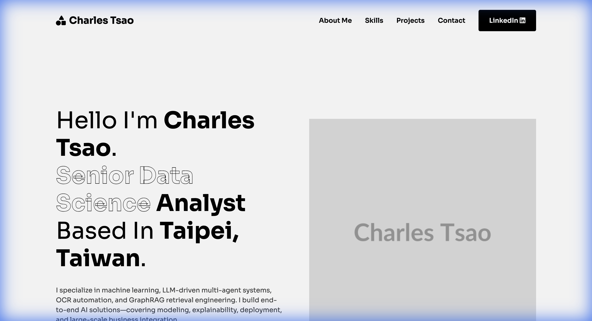
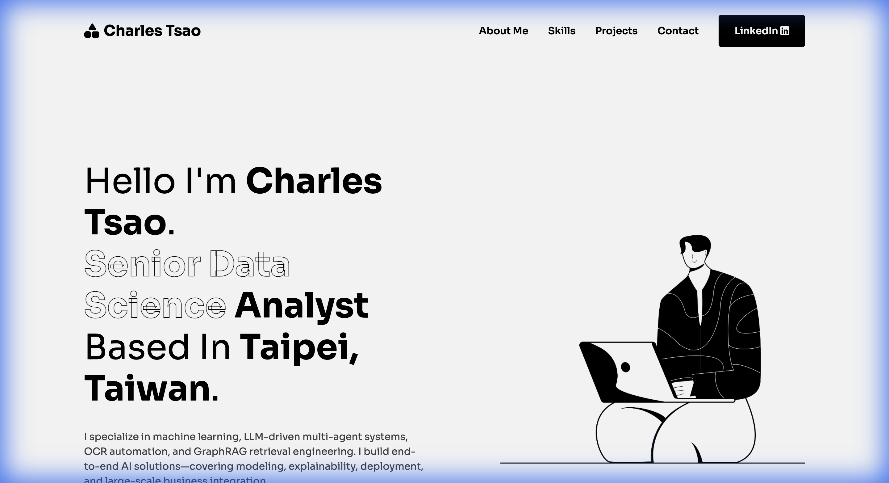
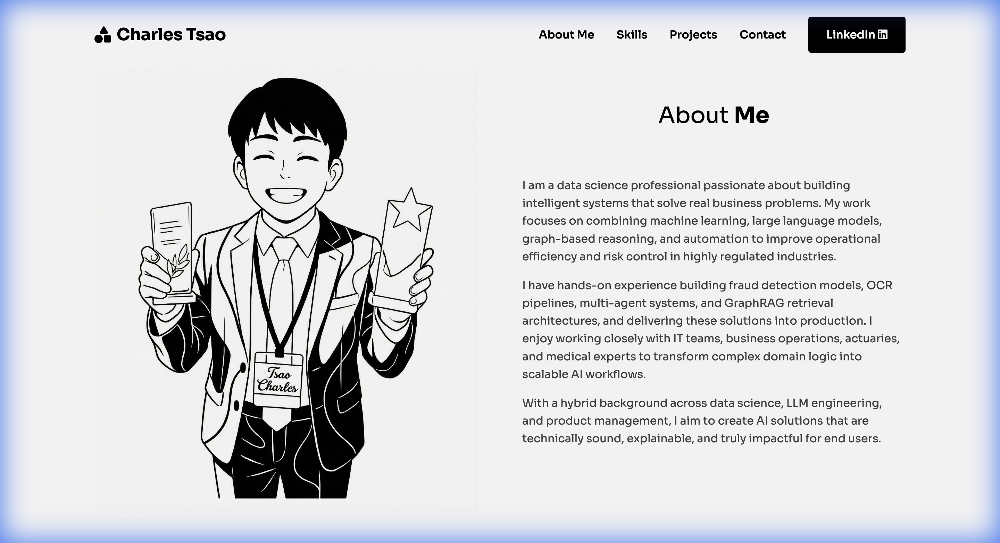
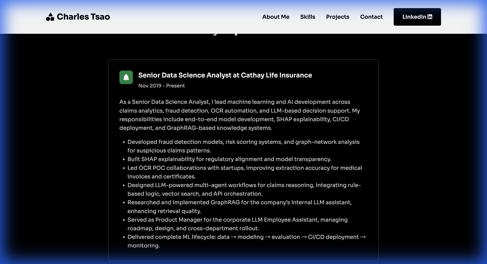
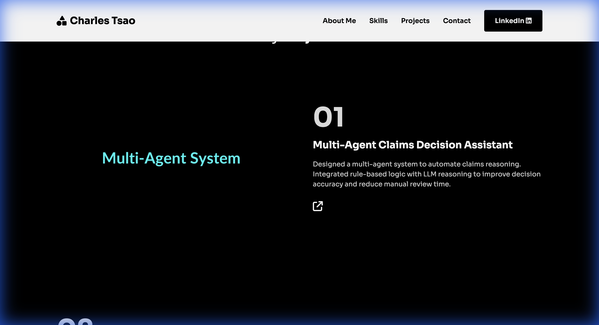
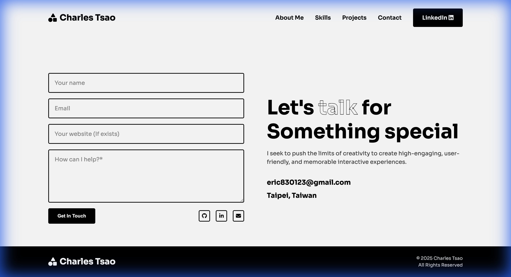
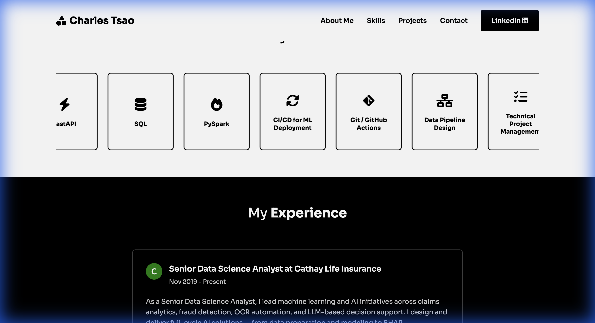
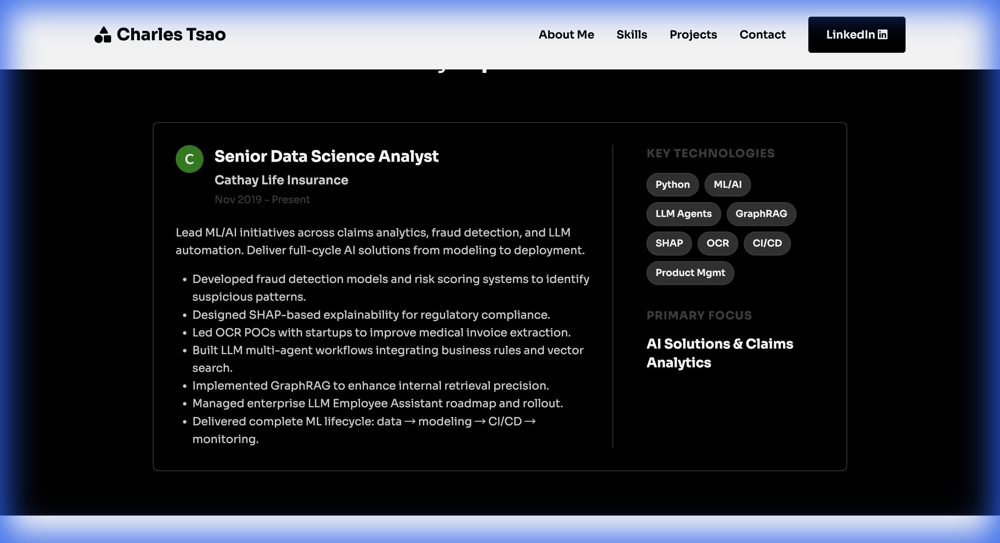

# Portfolio Website Walkthrough

I have successfully built the portfolio website based on the provided Figma design.

## Changes Made
- **HTML Structure**: Created a semantic `index.html` with sections for Hero, Skills, Experience, About, Projects, Testimonials, and Contact.
- **CSS Styling**: Created `style.css` with:
    - Custom variables for colors and fonts.
    - Mobile-first responsive design.
    - Flexbox and Grid layouts for complex sections.
    - "Illustration-Based" styling with clean typography (Sora font) and ample whitespace.
- **JavaScript**: Added `script.js` for the mobile navigation menu toggle.

## Verification
I have verified the implementation by rendering the page in a browser environment.

### Screenshot

## Updates
- **Content**: Replaced placeholder text with Charles Tsao's resume information.
- **Icons**: Updated skill icons to match the specific technical stack.
- **Images**: Replaced placeholders with uploaded assets and generated illustrations.
- **Sections**:
    - Replaced "What People Say" with a custom **Contact Section**.
    - Restyled **Projects Section** to "My Projects" with a dark background and alternating card layout.
    - Updated project images to **colorful black-background placeholders** (temporary due to generation limits).
- **Skills Section**: Updated to an **infinite scrolling marquee layout** (auto-scrolling loop) with smaller cards and no scrollbar.
- **Experience Section**: Optimized with a **two-column layout** (70/30 split).
    - **Left Column**: Simplified description and bullet points.
    - **Right Column**: Added "Key Technologies" pills and "Primary Focus" area for quick scanning.

## Next Steps
- Deploy the website to a hosting provider (e.g., GitHub Pages, Vercel).
